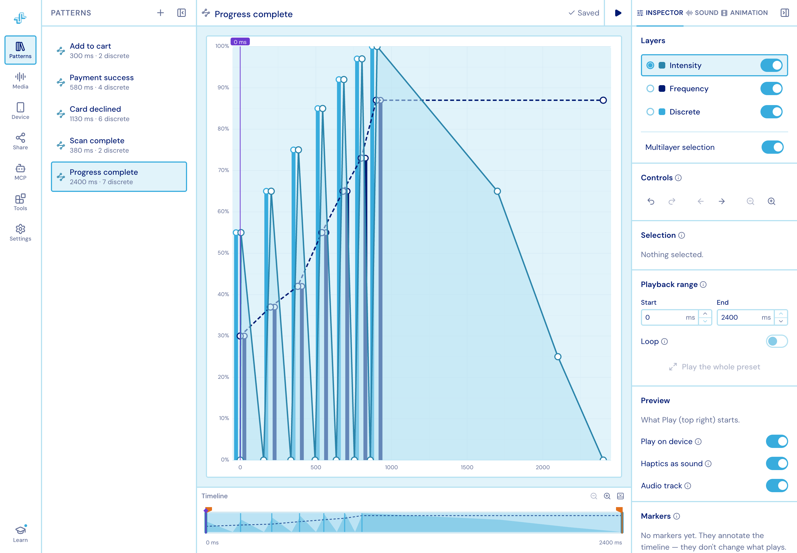
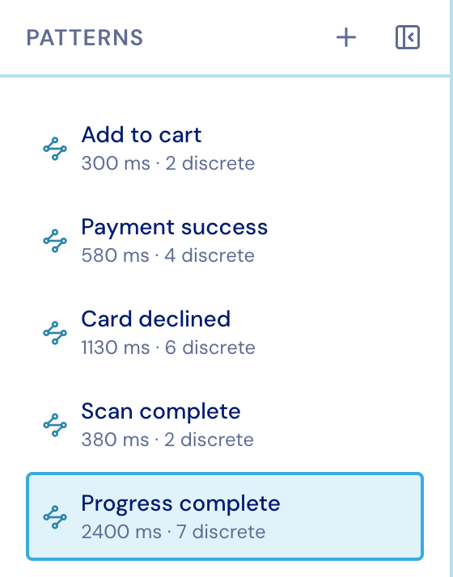
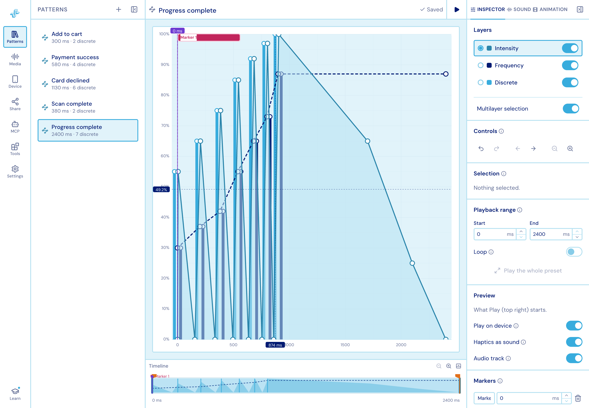
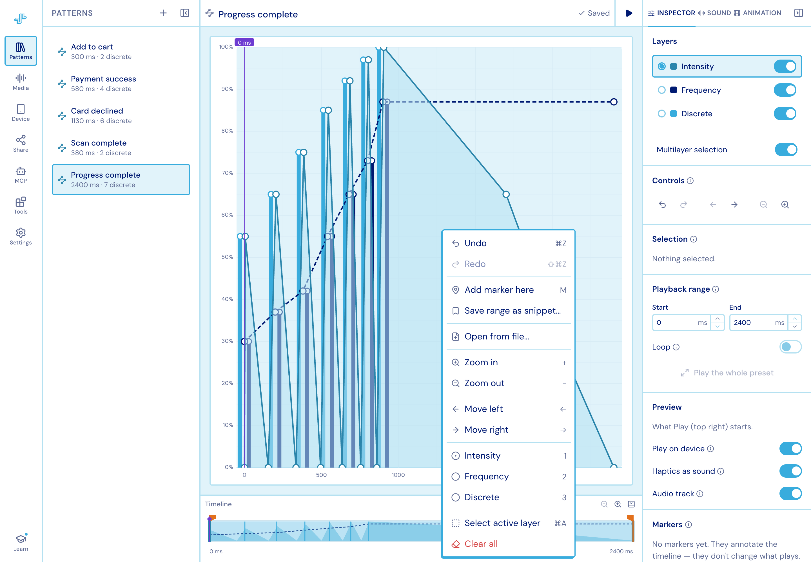
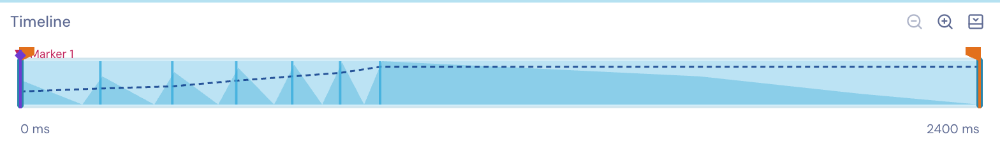
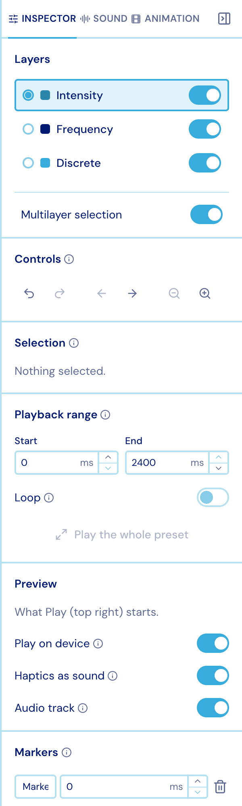

import { Aside } from '@astrojs/starlight/components';

Three columns, plus a bar of lanes under the chart.

## Left: the activity rail

Each icon opens a resizable column beside it; clicking the open one again closes it.

| Item | What it is for |
| --- | --- |
| **Patterns** | Every pattern in the project. This is the *only* pattern switcher. |
| **Media** | The audio and animation files uploaded to the project. |
| **Device** | Pairing with real phones. The icon turns **green** while a paired phone is reachable right now. |
| **Share** | A link a coworker can open on their own phone. |
| **MCP** | Connecting an AI agent to this editor. |
| **Tools** | Eight plugins — library, snippets, tap rhythm, voice sketch, time warp, trimming, analysis, linting. |
| **Settings** | Appearance, grid, precision, pointer, playback, selection, the shortcut list, and Help. |
| **Learn** | The walkthroughs. A dot means you have not finished them all. |

<figure class="studio-shot-narrow">

</figure>

Click a row to open that pattern; right-click one for **Rename**, **Duplicate** and
**Remove**. Only one pattern is open at a time.

## Middle: the chart

Time runs left to right, value bottom to top.

- **Double-click** empty canvas to add a point — or a tap, on the Discrete layer — to the
  **active** layer.
- **Drag** a point to move it. Hold **Shift** to lock it to one axis.
- **Marquee-drag** to select a group, then drag the group as a whole. A marquee covers
  only the active layer unless *Multilayer selection* is on.
- **Middle-drag** pans, **⌘/Ctrl + wheel** zooms at the pointer, and the wheel scrolls
  through time.
- **Crosshair rails** follow the pointer with an exact time and value readout.

**Right-click** the canvas for everything the keys do: undo/redo, add a marker, save the
framed range as a snippet, open a pattern from file, zoom and pan, switch the active
layer, select it all, or clear the pattern.

**Markers** are named points in time you drop on the chart. They annotate the timeline —
they never change what plays — and they save, sync and undo with the pattern.

## Under the chart: the lanes

All the lanes share the chart's time axis. The whole section is resizable and collapsible.

- **Timeline** — the viewport window, the marker lane, and the two handles that set the
  **play range**. Drag the needle to scrub.
- **Audio lane** (green) — the attached track's waveform, drawn over its trimmed window.
- **Animation lane** (violet) — a filmstrip of the attached Lottie's frames.

## Right: the inspector

<figure class="studio-shot-narrow">

</figure>

Three tabs:

- **Inspector** — layers, undo/redo and view controls, the current selection's exact
  values, the playback range, the Preview switches, markers, and Export.
- **Sound** — the attached track, its signal analysis, and the haptics generated from it.
  Always present, even with nothing attached.
- **Animation** — the same, for an attached Lottie.

Attaching audio or an animation selects the matching tab and un-collapses the column;
detaching drops back to Inspector. Both side columns have a hide button.

### Selection

Select points and the inspector shows exactly what you have, with editable values —
so a shape you dragged roughly into place can be finished by typing.

<figure class="studio-shot-narrow">

</figure>

<Aside>
**Undo/redo is per pattern** and covers document changes only — moving panels around is
never undoable. A drag is one undo step, not a hundred.
</Aside>
