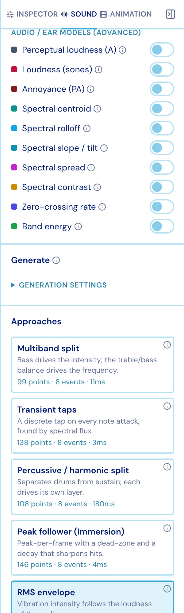
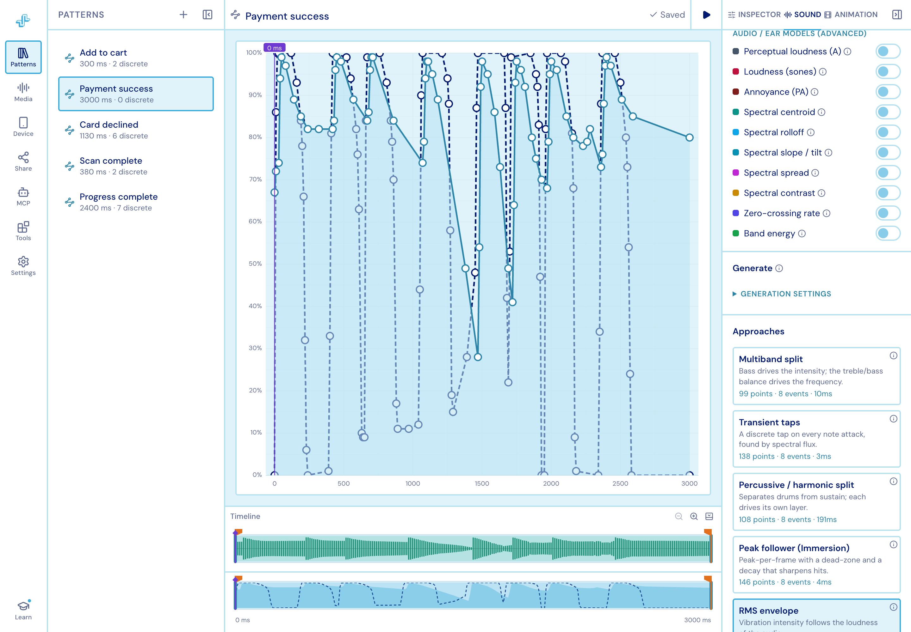
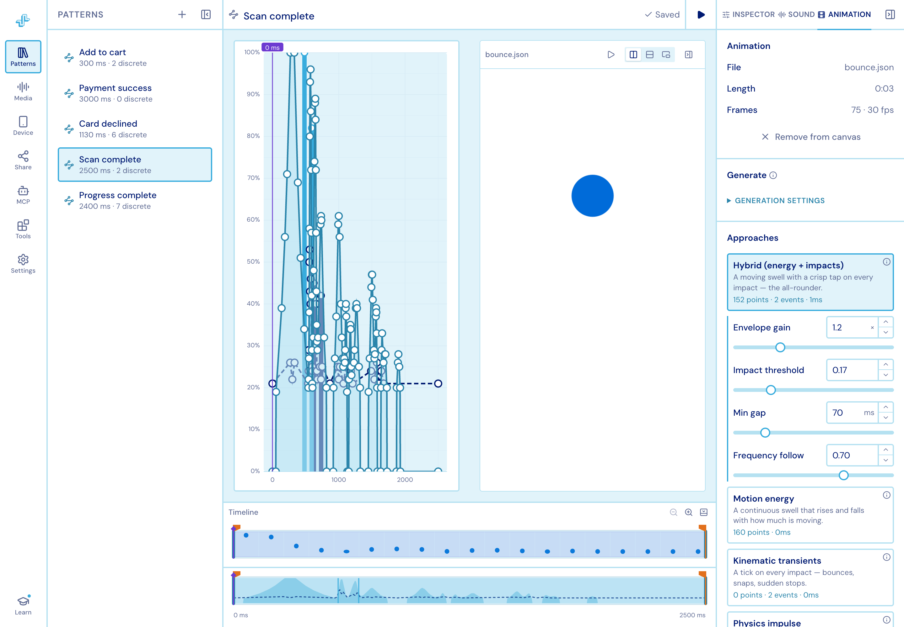
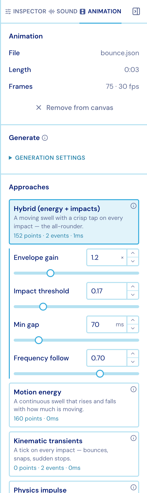

import { Aside } from '@astrojs/starlight/components';

## From audio

Attach a track and generation starts **by itself** — there is no Generate button. Nine
algorithms each read the same decoded signal and propose a whole pattern, with the point
and event count they would produce.

<figure class="studio-shot-narrow">

</figure>

| Approach | Reads |
| --- | --- |
| **RMS envelope** | Loudness over time, smoothed |
| **Perceptual loudness** | Loudness weighted the way hearing actually works |
| **Peak follower (Immersion)** | Fast attack, slow release — the classic transducer follower |
| **Transient taps** | Spectral-flux onsets, laid down as discrete taps |
| **Beat grid** | A tempo estimate, quantized to the beat |
| **Percussive / harmonic split** | Percussion → taps, tone → envelope |
| **Multiband split** | Separate bands driving intensity and frequency |
| **Melodic transcode** | Pitch into the frequency layer |
| **Filter-chain transcode (Android)** | Android's own audio-to-haptics filter chain |

Clicking one puts it on the chart, replacing **all three layers** — so trying another
costs nothing and nothing accumulates.

**Restore my pattern** puts your own work back. If you have edited a generated pattern,
switching approach offers to park those edits in a copy first. The choice is saved with
the pattern; the candidates themselves are re-derived every time, never stored.

<Aside title="Signal analysis">
The switches above the approaches overlay what the algorithms are reading — loudness,
spectral centroid, percussive share, pitch, tempo and more — on the chart. Useful for
understanding *why* an approach put a tap where it did.
</Aside>

## From animation

The same shape, for an attached Lottie. Studio samples the animation and measures how
much is moving, how fast, and where motion changes direction.

| Approach | What it makes |
| --- | --- |
| **Hybrid (energy + impacts)** | A moving swell with a crisp tap on every impact — the all-rounder |
| **Motion energy** | A continuous swell that rises and falls with how much is moving |
| **Kinematic transients** | A tick on every impact — bounces, snaps, sudden stops |
| **Physics impulse** | Collisions and landings weighted by mass and momentum |
| **Channel mapping** | Each transform channel wired straight to a haptic dimension |

<figure class="studio-shot-narrow">

</figure>

## From your own performance

Two tools under **Tools ▸ Generate** turn a performance into a pattern:

- **Tap Rhythm** — tap a beat on the mouse, touchpad or keyboard and it lands as discrete
  events.
- **Voice Sketch** — hum, buzz or shush into the microphone and the shape of the sound
  becomes a pattern: loudness drives intensity, pitch drives frequency over a fixed
  70–600 Hz register, and syllable onsets become taps. Takes are capped at 15 seconds.
