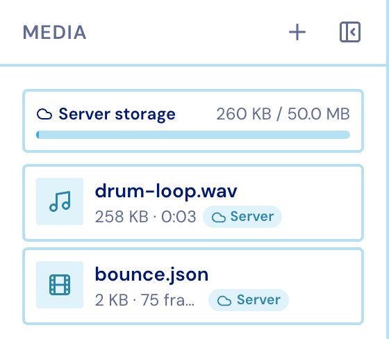
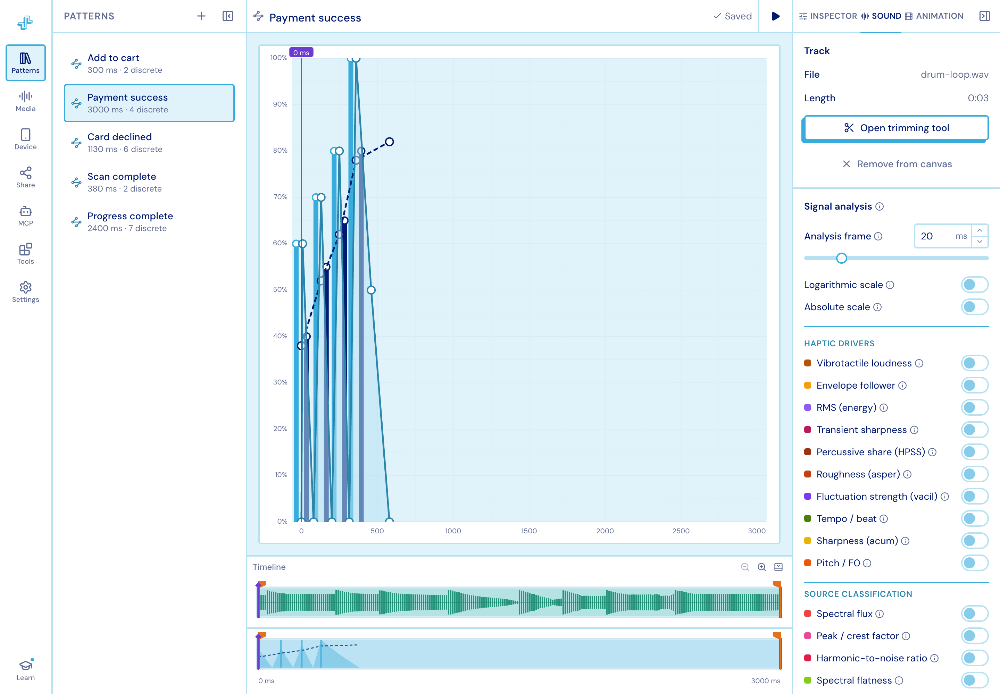

import { Aside } from '@astrojs/starlight/components';

Audio and Lottie animations are **uploaded per project** and **attached per pattern**.

<figure class="studio-shot-narrow">

</figure>

## Getting files in

- Drop files onto the Media column, or straight onto the chart — a drop on the chart also
  attaches them.
- Type is decided by the file's **content**, not its extension.
- Audio: MP3 and WAV. Animation: `.json` or `.lottie`.
- **50 MB per account**, with a smaller per-file ceiling; the usage bar at the top of the
  panel shows where you stand. A file that would push you over is kept in this browser
  instead, and its card says so.

Each card's context menu has **Add to canvas**, **Play**, **Move to browser storage** /
**Upload to cloud**, **Download**, **Rename** and **Delete**.

## Attaching

Attaching binds a file to the pattern you have open and raises the matching lane under
the chart and the matching inspector tab. Detaching drops back to the Inspector tab.

An attached track floors the pattern's duration, and its waveform is drawn in the audio
lane so you can line taps up with what you hear.

## Trimming

**Tools ▸ Audio Trim** picks which stretch of a track the timeline uses. Set a start and
end, preview it, and apply.

<figure class="studio-shot-narrow">

</figure>

<Aside>
The file itself is never re-cut — the trim travels with the attachment as a window, and
is handed to the SDK (and to a paired phone) to apply.
</Aside>
