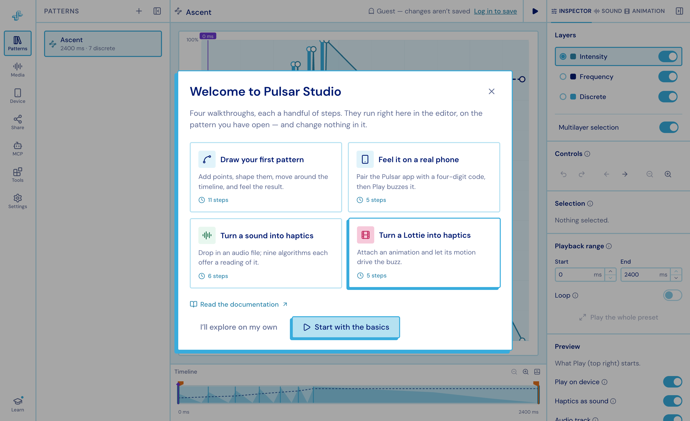

import { Aside, CardGrid, LinkCard } from '@astrojs/starlight/components';
import { BASE_PATH } from '../../../../config';

**Pulsar Studio** is a web app for designing haptic patterns. You draw a buzz on a
timeline, feel it on a real phone while you edit, and export it into your app through
the Pulsar SDK.

## What a pattern is

A pattern is three parallel layers over the same span of time:

| Layer | What it controls |
| --- | --- |
| **Intensity** | How hard the vibration is at each moment — a continuous envelope |
| **Frequency** | How sharp or dull it feels — a continuous envelope ("sharpness" in Apple's terms) |
| **Discrete** | Individual taps — a single, instantaneous click at one point in time |

Values are shown as percentages and stored as 0–1, which is what the SDK expects. Time
is milliseconds throughout. A pattern's **duration is derived** from its content: the
last point or tap defines the end.

## Where patterns live

A **project** holds many patterns plus the audio and animation files uploaded to it.
The dashboard lists your projects as cards with a strip of pattern thumbnails — drag a
thumbnail from one card onto another to copy that pattern across, without opening either.

## Getting started

Studio greets you the first time you open the editor with four walkthroughs. They run
over the live app, opening the panels they describe as they go, and change nothing in
your pattern.

1. **Draw your first pattern** — adding and moving points, the three layers, getting
   around the chart, the timeline, and what Play does. The long one, and the one to
   take first.
2. **Feel it on a real phone** — pairing, and what the row switch changes.
3. **Turn a sound into haptics** — attaching audio and picking a generated approach.
4. **Turn a Lottie into haptics** — the same for animation.

Leave one at any point (Escape, the X, or a click outside) and pick it up later:
**Learn** at the foot of the editor's left rail, the **Help** section in the editor's
Settings panel, or **Help & learning** on the Settings page.

<Aside title="No account yet?">
Every "Edit in Studio" link in these docs opens the preset straight in the editor, and
offers **Continue as guest** — the full editor, with changes kept in that browser tab
only. Sign in to keep them.
</Aside>

## Read on

<CardGrid>
  <LinkCard
    title="The editor"
    href={`${BASE_PATH}/studio/editor/`}
    description="The three columns, the chart, the timeline lanes and the inspector."
  />
  <LinkCard
    title="Playing it back"
    href={`${BASE_PATH}/studio/playback/`}
    description="One Play button, the preview switches, paired phones and share links."
  />
  <LinkCard
    title="Media"
    href={`${BASE_PATH}/studio/media/`}
    description="Audio tracks and Lottie animations, uploaded per project and attached per pattern."
  />
  <LinkCard
    title="Generating haptics"
    href={`${BASE_PATH}/studio/generating/`}
    description="Nine approaches from a sound, five from an animation, plus tapping and humming."
  />
  <LinkCard
    title="Tools"
    href={`${BASE_PATH}/studio/tools/`}
    description="The library, snippets, time warp, trimming, analysis and the compatibility linter."
  />
  <LinkCard
    title="Projects & files"
    href={`${BASE_PATH}/studio/projects/`}
    description="Offline-first saving, syncing across tabs, and getting patterns in and out."
  />
  <LinkCard
    title="Settings & shortcuts"
    href={`${BASE_PATH}/studio/settings/`}
    description="Appearance, grid, precision, pointer, and the full key reference."
  />
  <LinkCard
    title="Studio MCP"
    href={`${BASE_PATH}/studio/mcp/`}
    description="Let an AI agent drive your live editor while you watch."
  />
</CardGrid>
