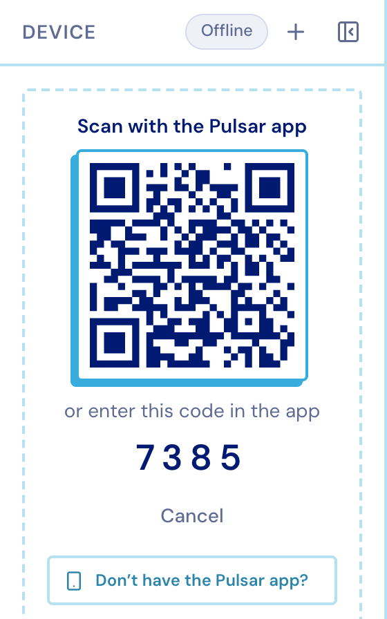
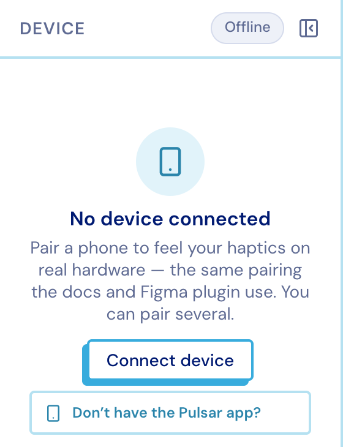
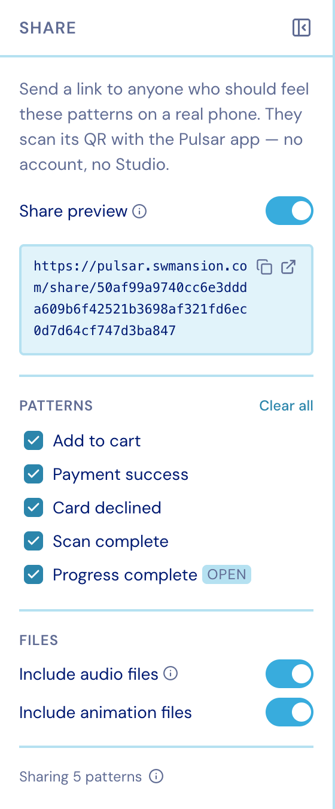

import { Aside } from '@astrojs/starlight/components';

## One Play button

There is **one** Play button, and one press starts everything the pattern has:

- the **audible preview** — the haptics played through your speakers as a motor-like
  stand-in, so you can judge a pattern with no hardware in reach;
- the **attached audio track**;
- the **attached animation**;
- every **armed phone**.

Three switches in the Inspector's *Preview* block decide what a press covers: **Play on
device**, **Haptics as sound** and **Audio track**. The sound stand-in steps aside when
something real would take its place — a track that will actually play, or an animation
while a phone already carries the haptics. Two sounds at once is neither.

Play is bounded by the **play range**, the two handles on the timeline. The start marker
becomes t=0 on the wire and the values at both markers are sampled from the envelope, so
starting mid-fade starts mid-fade.

`P` plays and stops.

## Feeling it on a real phone

Studio is a *sender* on the Pulsar relay and the **Pulsar app** (App Store, Google Play)
is a *receiver* — the same pairing these docs and the Figma plugin use.

<figure class="studio-shot-narrow">

</figure>

1. **Device ▸ Connect device** mints a four-digit code and a QR.
2. Scan the QR with the Pulsar app, or type the code in.
3. The pairing is remembered, so a reload silently reconnects.

<figure class="studio-shot-narrow">

</figure>

Worth knowing:

- **Pair as many phones as you like.** Each is its own channel and a send goes to all of
  them at once — which is the point, when you are comparing two handsets side by side.
- Each row shows what that phone's hardware can actually feel, from `none` to `advanced`.
- **The row switch arms a phone for the toolbar's Play.** The buttons inside the panel
  ignore it: those are explicit instructions and always fire.
- **Paired ≠ connected.** A phone that walks away stays paired; sends fail until it comes
  back, and the token stays valid throughout.
- With audio or an animation attached, the whole file is delivered to the phone (a trim
  rides along as a window for the SDK to apply) and the whole pattern plays — media sends
  are not cut to the play range.

<Aside title="The activity rail tells you">
The **Device** icon is green only while a paired phone is reachable *this second*.
Paired-but-away is not green.
</Aside>

## Sharing with someone who has no Studio

**Share** mints a public link. Whoever opens it gets a QR their phone can scan, and the
pattern plays on their device — no account, no editor.

<figure class="studio-shot-narrow">

</figure>

- Pick which patterns the link carries, and whether the audio and animation files ride
  along.
- The link is **live by reference**: whoever holds it always gets the current version.
- Turning the link off revokes it. Turning it back on issues a **new** token, so the old
  URL stays dead — while your own paired phones keep working throughout.
