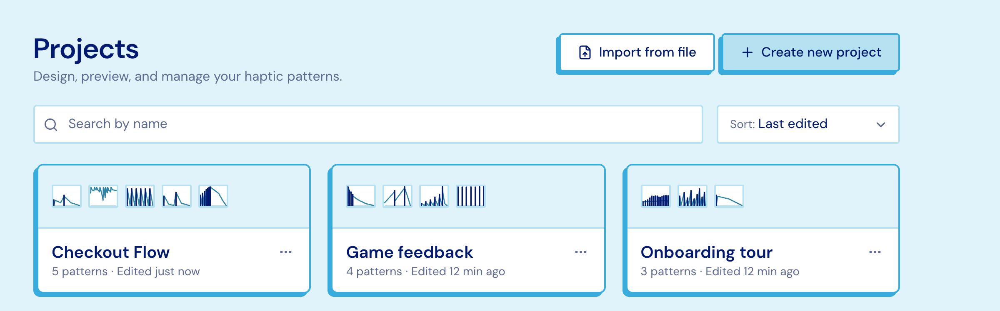
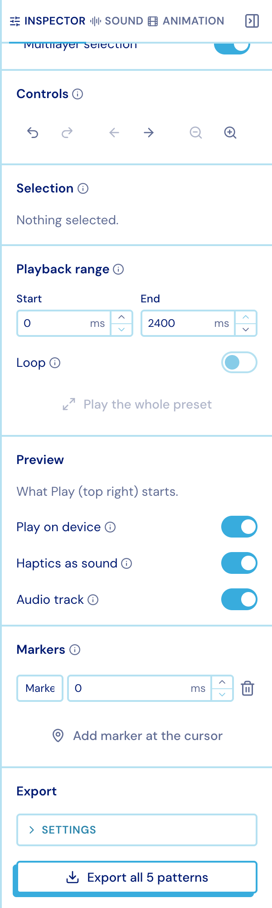

import { Aside } from '@astrojs/starlight/components';

## Projects

A **project** holds many patterns plus its uploaded media. On the dashboard you can
create one, import one, rename, duplicate or delete it, and search and sort the list.

Drag a pattern thumbnail from one card onto another to **copy** it there — no need to
open either project.

## Saving

- **Everything is saved locally first.** Edits go into this browser immediately and sync
  to your account when you are online, so a closed tab, a flaky connection or a flight
  loses nothing.
- The editor **autosaves**; `⌘S` / `Ctrl+S` forces a save now.
- Only **one tab at a time** writes a given project. A second tab follows along and can
  take over.
- If a project changed elsewhere while you had unsynced edits, Studio asks rather than
  guessing.

<Aside>
The Settings page shows what is in your account against what this browser has cached, and
lets you clear the local copy once everything has synced.
</Aside>

## Getting patterns in and out

**In** — Apple Core Haptics `.ahap`, Lofelt, plain pattern JSON, and `.pulsar` bundles.
The format is sniffed from the file's contents, so a misnamed file still works. Drop a
`.pulsar` on the dashboard to land a whole new project.

**Out** — a `.pulsar` bundle: the patterns you tick, plus optionally their audio and
animation files.

<figure class="studio-shot-narrow">

</figure>

<Aside type="note">
Exporting requires an activated licence. Everything else in Studio is free.
</Aside>
