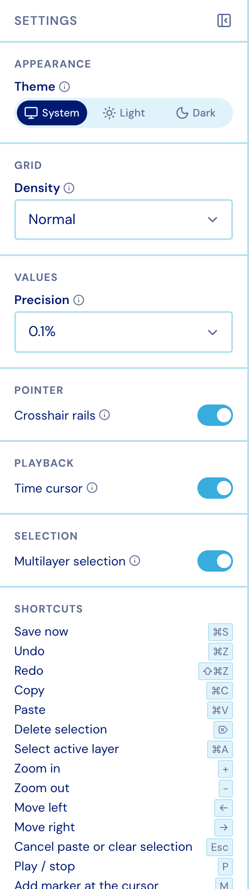
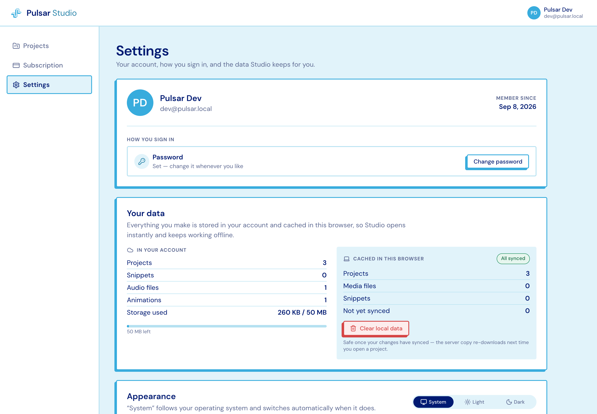

## In the editor

The rail's **Settings** panel holds everything that changes how the editor behaves:
theme, grid density, value precision, the crosshair rails, the time cursor, multilayer
selection, playback preferences, the full keyboard and mouse reference, **Help** (which
replays the walkthroughs), and a link out to your account.

<figure class="studio-shot-narrow">

</figure>

## On the Settings page

The dashboard's **Settings** page covers the account: who you are and how you sign in,
what is in your account against what this browser has cached, clearing local data,
appearance, Help & learning, and deleting your account.

Studio follows your operating system's light/dark setting unless you override it.

## Keys

The Settings panel's shortcut list is generated from the same registry the key handlers
match on, so it can only ever advertise keys that work. Worth memorising:

| Key | Does |
| --- | --- |
| `P` | Play / stop |
| `1` `2` `3` | Activate Intensity / Frequency / Discrete |
| `⌘Z` / `⇧⌘Z` | Undo / redo |
| `⌘A` | Select everything on the active layer |
| `⌘S` | Save now |
| `+` / `-` | Zoom in / out |
| Arrow keys | Scroll through time |
| `M` | Add a marker at the cursor |
| `Esc` | Back out of one thing — paste ghost, then snippet rails, then the selection |

Pointer gestures: **double-click** to add, **drag** to move, **Shift+drag** to constrain
to one axis, **marquee-drag** to select a group, **middle-drag** to pan, **⌘/Ctrl+wheel**
to zoom at the pointer, **wheel** to scroll through time.
