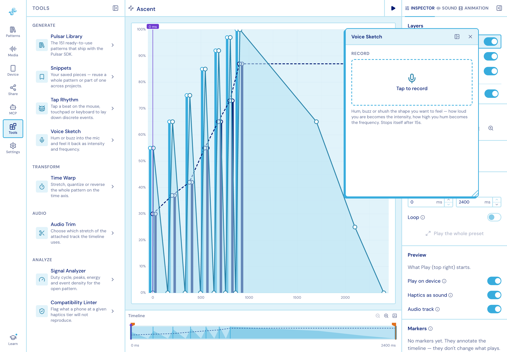
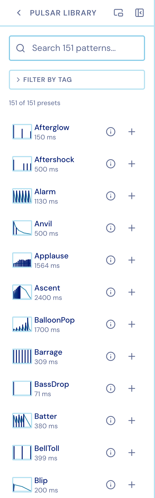
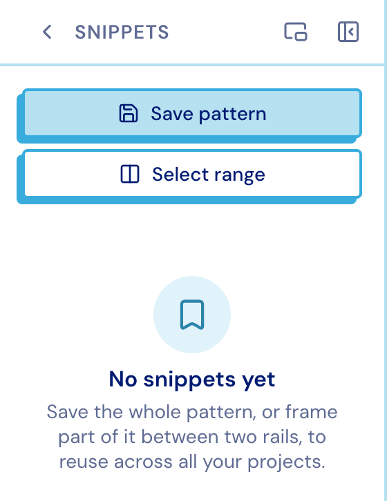
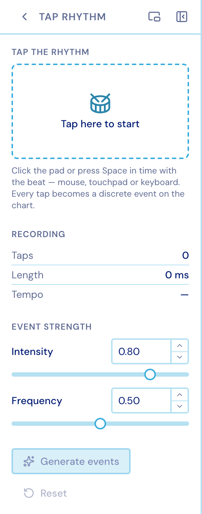
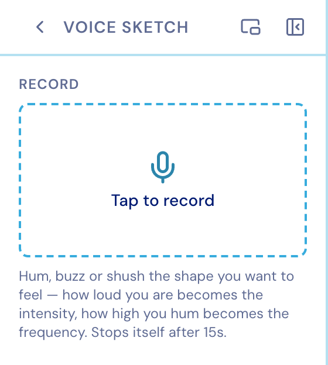
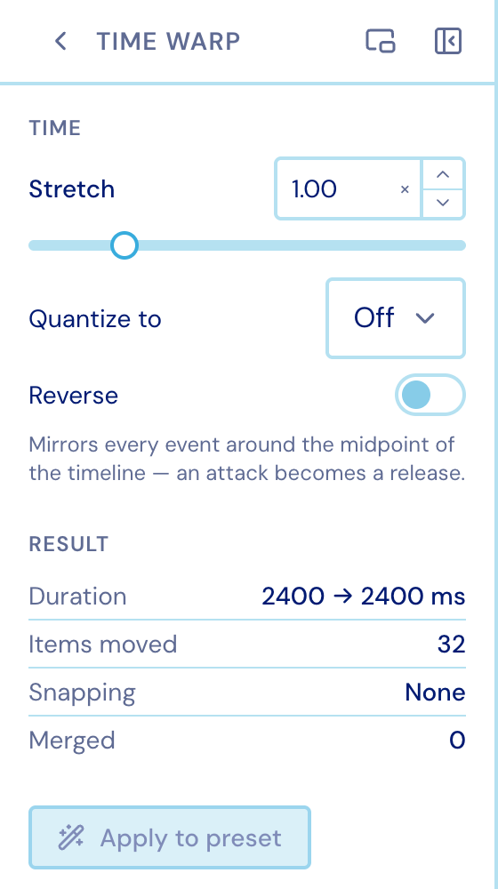
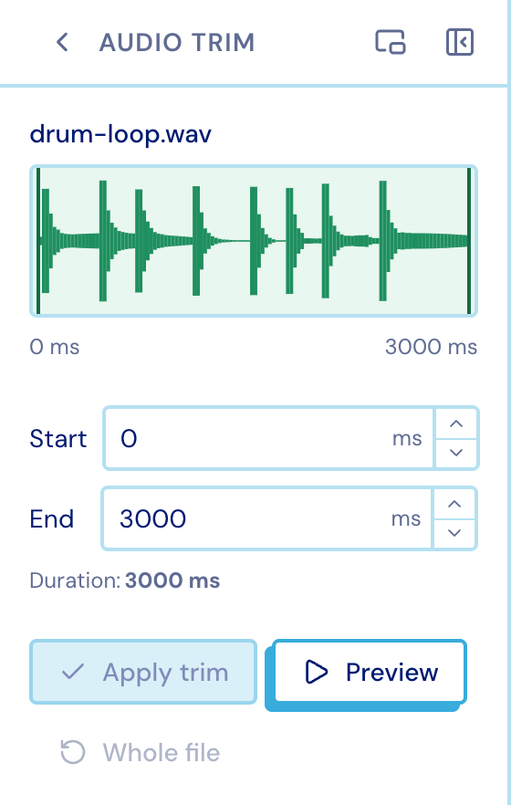
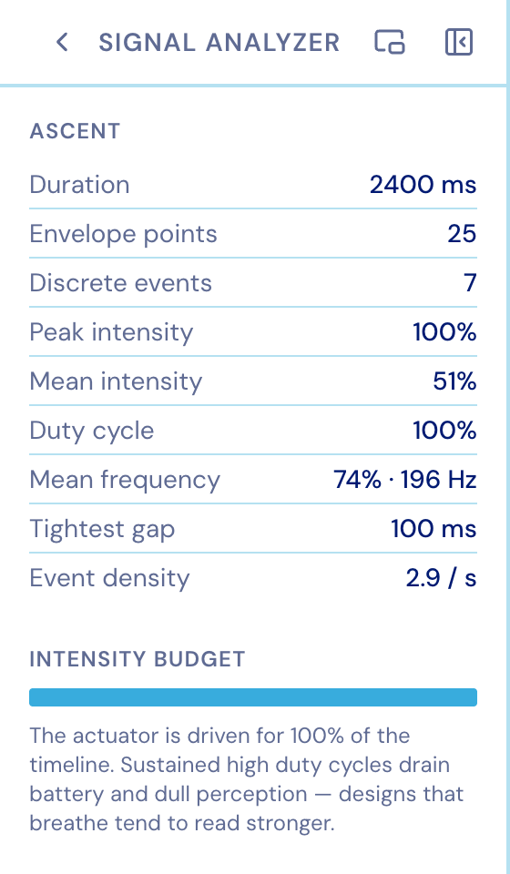
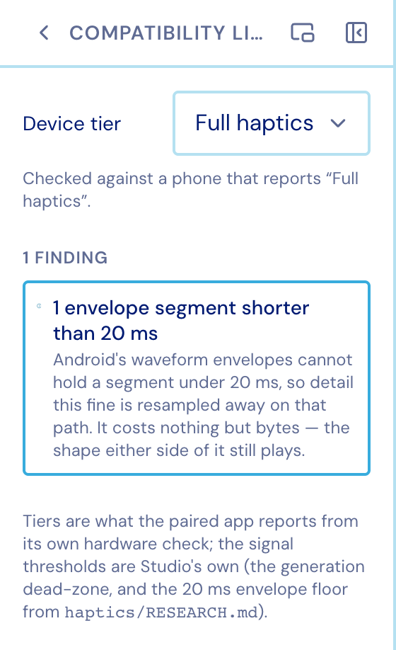

Eight plugins, grouped by what they do. Open one inside the column, or **pop it out** into
a floating window and keep working on the chart underneath.

## Generate

### Pulsar Library

The 151 ready-to-use patterns that ship with the Pulsar SDK, searchable and
tag-filterable, each with a thumbnail and its duration. Insert one into the pattern you
have open.

<figure class="studio-shot-narrow">

</figure>

### Snippets

Your own saved pieces. Capture the whole pattern, or frame a range on the chart and save
just that, then drop it back in anywhere — in any project.

<figure class="studio-shot-narrow">

</figure>

### Tap Rhythm

Tap a beat on the mouse, touchpad or keyboard; it lands on the Discrete layer.

<figure class="studio-shot-narrow">

</figure>

### Voice Sketch

Hum or buzz into the mic and feel it back as intensity and frequency. Takes stop
themselves after 15 seconds.

<figure class="studio-shot-narrow">

</figure>

## Transform

### Time Warp

Stretch, quantize or reverse the whole pattern on the time axis.

<figure class="studio-shot-narrow">

</figure>

## Audio

### Audio Trim

Choose which stretch of the attached track the timeline uses. See
[Media](../media/).

<figure class="studio-shot-narrow">

</figure>

## Analyze

### Signal Analyzer

Duration, envelope points, discrete events, peak and mean intensity, duty cycle, mean
frequency, the tightest gap and event density for the open pattern — plus an intensity
budget that says, in words, whether the actuator is being driven too hard for too long.

<figure class="studio-shot-narrow">

</figure>

### Compatibility Linter

Flags what a phone at a given haptics tier will not reproduce, before you ship it.

<figure class="studio-shot-narrow">

</figure>
